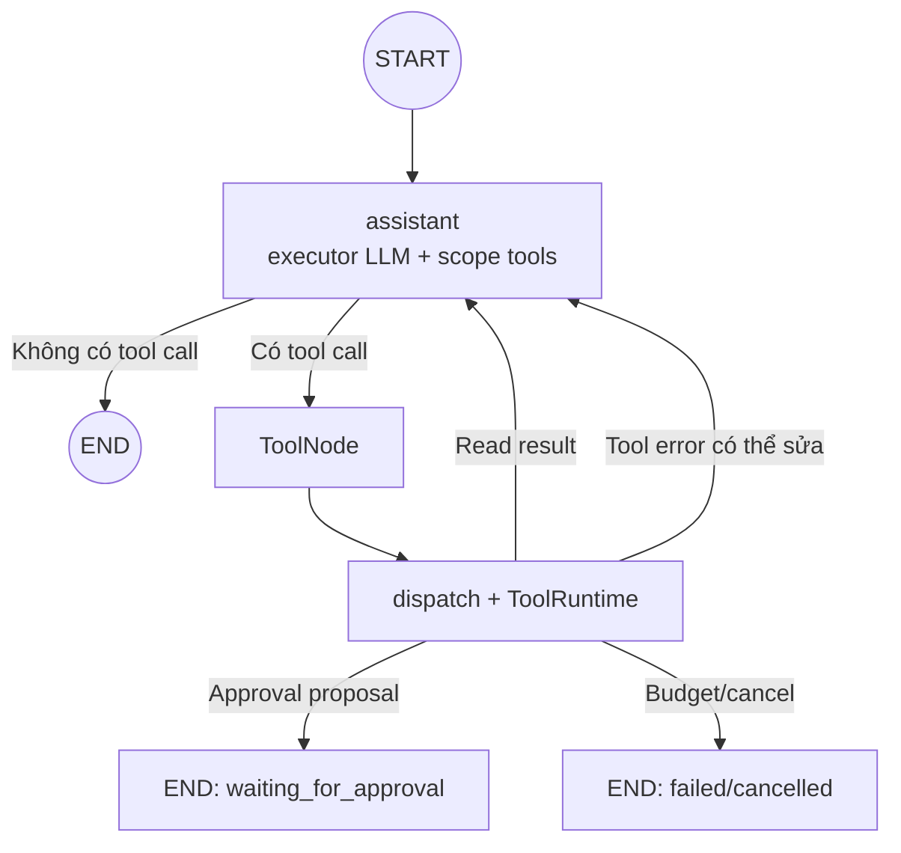
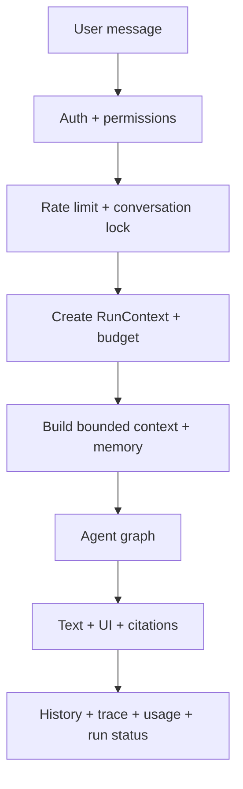
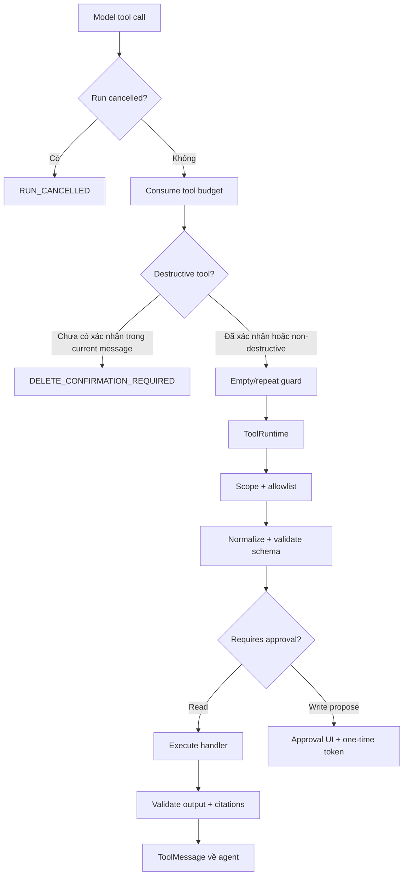

# Quiz AI — agent-first orchestration

Tài liệu này mô tả live path mặc định sau refactor. Mục tiêu là giữ Quiz AI là
một agent tự chọn tool, đồng thời giảm các model call và orchestration layer
không cần thiết.

## Quyết định

Live mode mặc định:

```env
AI_ORCHESTRATION_MODE=agent_first
```

Rollback mode:

```env
AI_ORCHESTRATION_MODE=planner_legacy
```

`planner_legacy` giữ nguyên planner cascade, intent repair và deterministic
selector cũ trong giai đoạn rollout. Nó không phải target architecture dài hạn.

## Boundary

Agent được quyền:

- hiểu hội thoại;
- chọn read/write tool phù hợp;
- đọc tool result và điều chỉnh cách làm;
- hỏi clarification;
- quyết định khi nào đã đủ thông tin để trả lời.

Runtime luôn sở hữu:

- authentication và trusted scope;
- tool allowlist theo scope;
- schema validation;
- ownership/RBAC backend;
- timeout, budget và cancellation;
- destructive confirmation;
- write proposal, approval và idempotency;
- checkpoint, trace, audit và metrics.

Model chỉ đề xuất hành động. Runtime mới là authority quyết định hành động có
được thực hiện hay không.

## Live graph



Agent-first không còn chạy:

```text
fast planner
  -> strong planner
  -> intent repair
  -> direct selector branch
  -> executor graph
  -> orchestrator auto-propose
```

trước mỗi request.

## Request lifecycle



Auth, HTTP transport và persistence adapter nằm ngoài graph vì chúng là
infrastructure boundary, không phải agent reasoning.

## Tool flow



`parallel_tool_calls=false` ở agent-first để một model turn không tạo nhiều
write proposal đồng thời. Agent có thể gọi tuần tự các read prerequisite rồi
đề xuất đúng một write action.

## Write approval compatibility

Trong migration hiện tại, write contract với web được giữ nguyên:

```text
agent calls write tool
  -> runtime creates proposal only
  -> graph stops with waiting_for_approval
  -> UI sends __approve__:<one-time-token>
  -> runtime verifies user/scope/auth fingerprint/TTL
  -> execute with idempotency key
  -> backend result
```

Approval chưa chuyển sang native LangGraph `interrupt()` trong commit này vì
việc đó thay đổi resume protocol giữa web, FastAPI, checkpointer và background
worker. Đưa interrupt vào nhưng vẫn giữ token flow cũ sẽ tạo hai source of truth
và checkpoint bị treo.

Native interrupt chỉ nên triển khai ở migration riêng khi client gửi
`run_id + decision`, `_approve()` được thay bằng `Command(resume=...)`, và test
đã chứng minh worker restart vẫn resume đúng checkpoint.

## Structured form fast path

Form do server render gửi `form_submission` riêng trong request:

```json
{
  "message": "Thông tin tạo quiz từ form",
  "form_submission": {
    "form_id": "quiz-create-form",
    "values": {
      "title": "Python cơ bản",
      "category": "Lập trình",
      "difficulty": "EASY",
      "time_limit": "300",
      "quiz_type": "MULTIPLE_CHOICE"
    }
  }
}
```

`quiz-create-form` đi qua server-owned handler:

```text
validate JSON
  -> list_categories
  -> map category name/slug/id thành category_id thật
  -> create_quiz proposal
  -> trả UI Accept
```

Handler này không gọi planner hoặc executor LLM. Form ID chỉ chọn handler;
client values vẫn là untrusted input và tiếp tục qua scope, schema, ownership,
approval và backend validation. Form ID chưa có handler sẽ fallback về agent
loop để không làm mất khả năng mở rộng các form mới.

## Model-call budget

Số liệu dưới đây là số model call theo topology, chưa phải benchmark latency
trên provider thật.

| Request | Planner legacy | Agent first |
|---|---:|---:|
| General response | fast planner + executor = 2 | executor = 1 |
| Tool request rõ ràng | planner + executor + final executor = 3 | executor + final executor = 2 |
| Write/ambiguous | fast + strong + executor loop = 3 trở lên | executor loop = 1 trở lên |
| Direct selector cũ | planner + formatter = 1 model | executor + final executor = 2 |

Agent-first tối ưu general và các task agentic phức tạp. Một số read selector
đơn giản có thể có thêm một final model call so với formatter cũ; đổi lại toàn
bộ hành vi hội thoại đi qua một agent loop nhất quán. Latency thật cần đo theo
scenario trước khi xóa legacy mode.

## Agent graph state

LangGraph checkpoint hiện chứa:

```text
messages
run_id
scope
intent
orchestration_mode
```

Run-level budget, citations, UI surface và approval token vẫn thuộc runtime
state vì phải tương thích DurableRunStore và SSE contract hiện tại. Chúng sẽ
được chuyển dần vào graph state khi native approval resume được triển khai.

## Intent reporting

Agent không bắt buộc gọi `plan_interaction` chỉ để phân loại. Intent được lấy
theo thứ tự:

1. `plan_interaction` khi agent thật sự cần policy/form/clarification;
2. hint từ domain tool đầu tiên;
3. `model_routed` khi agent trả lời trực tiếp mà không dùng tool.

Intent hint dùng cho trace/evaluation, không cấp quyền. Quyền luôn đến từ
trusted scope và ToolRuntime.

## Rollout

1. Deploy `agent_first` vào development/staging.
2. Chạy golden scenarios cho general, read, write proposal, destructive guard,
   citation và multi-turn correction.
3. So sánh p50/p95 latency, model calls, tool trajectory, task success và cost
   với `planner_legacy`.
4. Nếu regression vượt ngưỡng, đổi env về `planner_legacy` và restart agent;
   không cần rollback database hoặc API.
5. Khi agent-first ổn định, xóa direct selector và planner live code cũ trong
   một cleanup commit riêng.
6. Sau đó mới migrate approval token flow sang native interrupt/resume.

## Acceptance gates

- General request dùng đúng một model call.
- Agent-first không gọi `LangGraphQuizRunner.plan()`.
- Tool ngoài scope luôn bị từ chối ở runtime.
- Delete không tạo proposal nếu current message chưa xác nhận rõ ràng.
- Write chỉ trả thành công sau backend execute result.
- Budget, cancellation, citation abstention và SSE contract không regression.
- Toàn bộ AI-agent unit tests pass.
