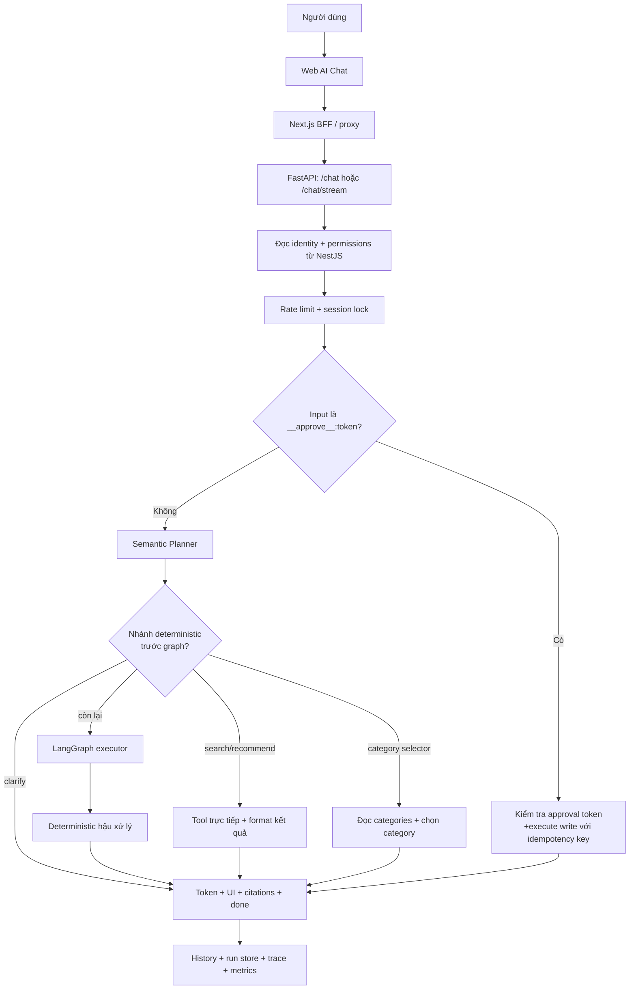
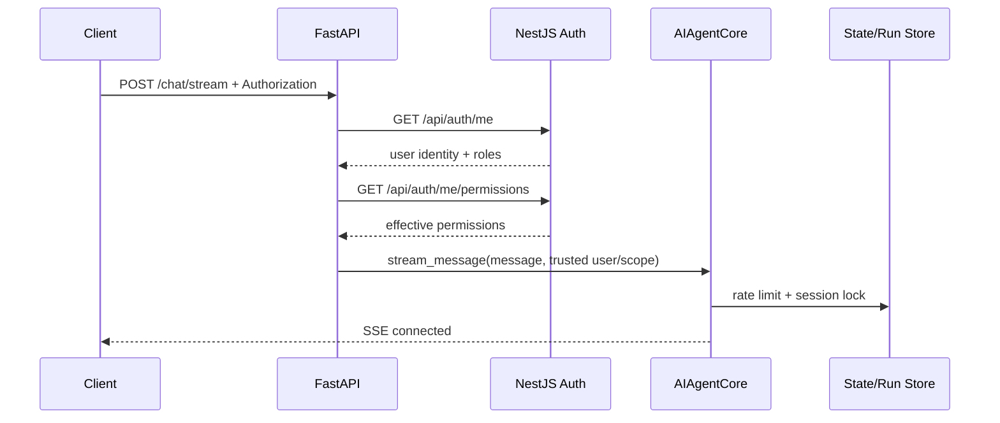
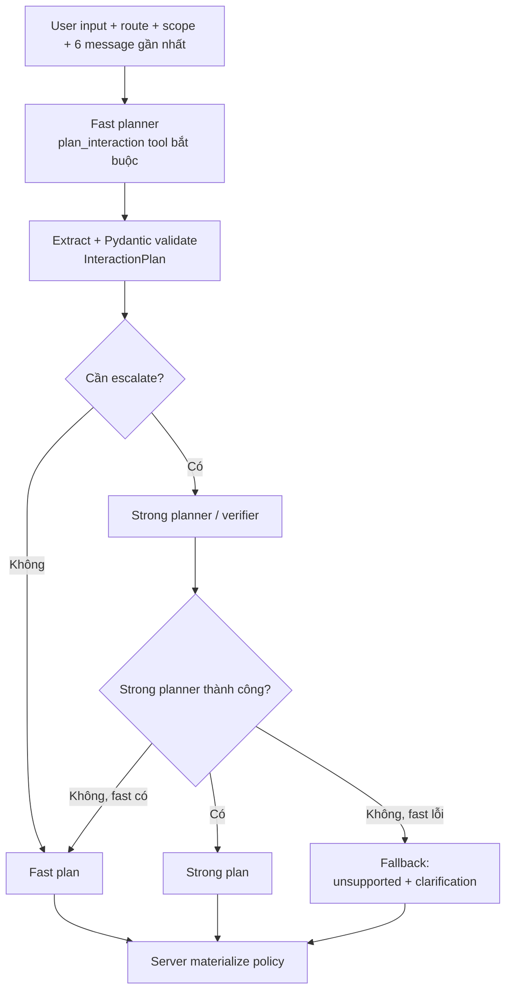
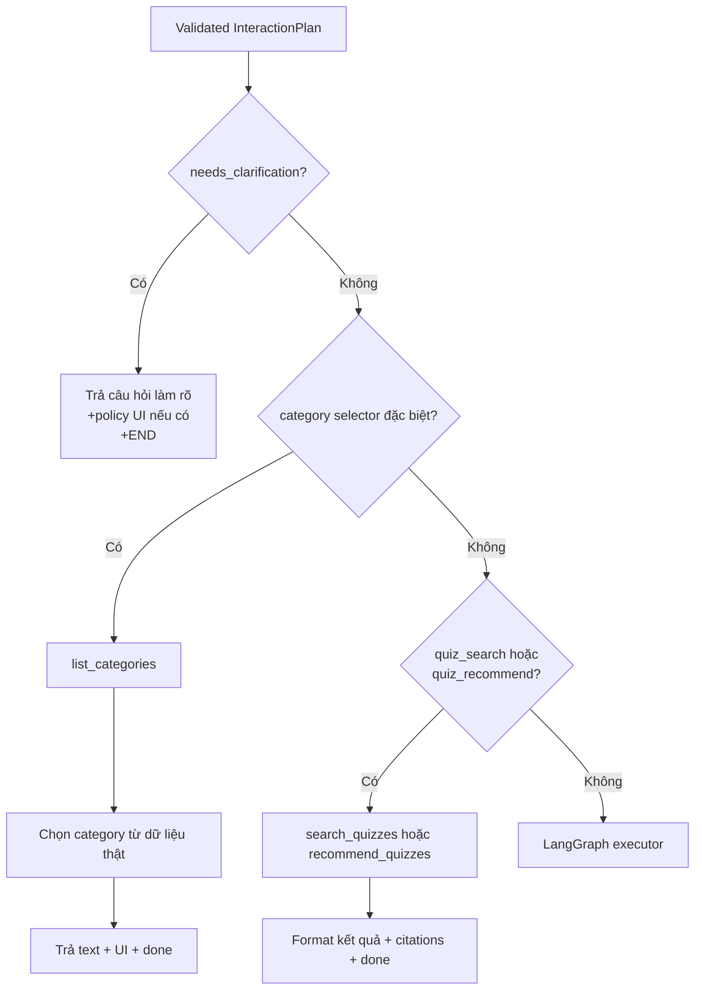
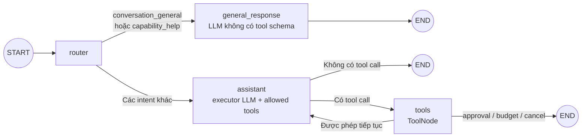
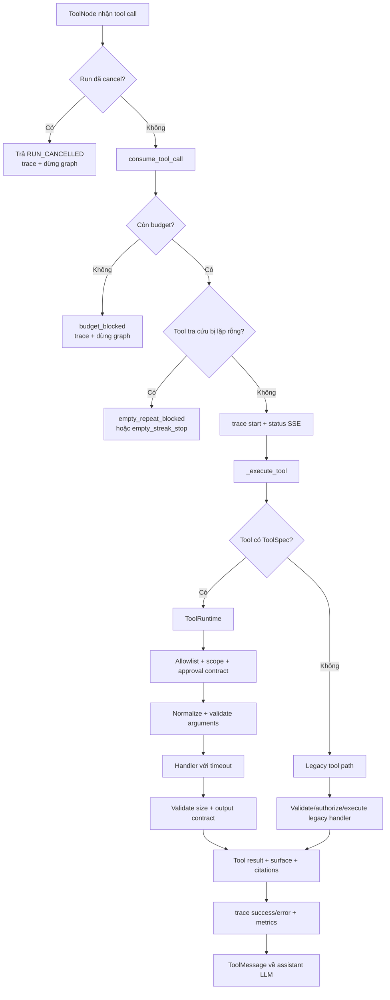
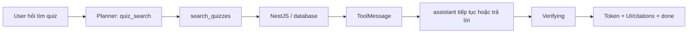
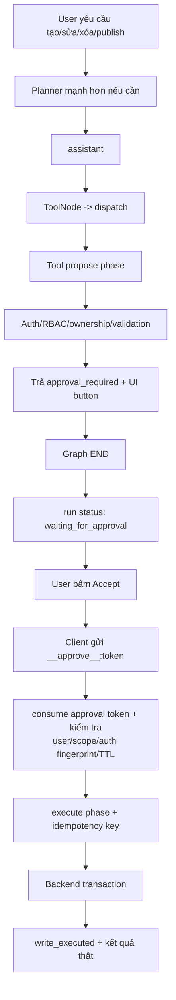
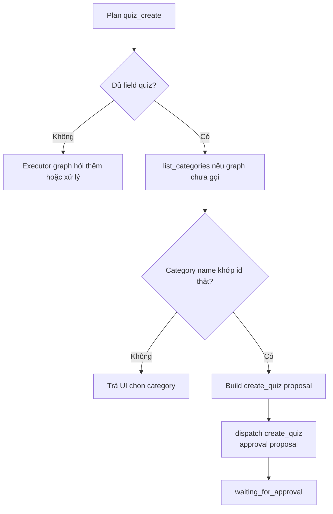
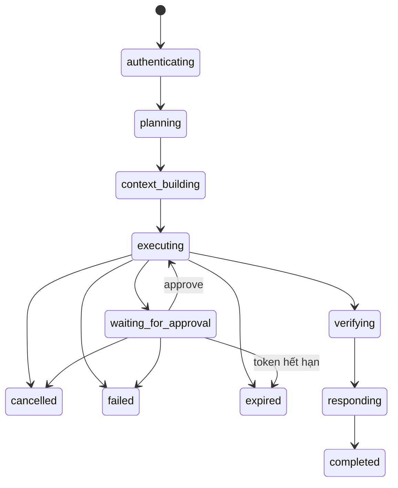

# Luồng LangGraph của Quiz AI Agent

Tài liệu này mô tả luồng đang chạy trong code hiện tại, tập trung vào đường
`AGENT_ORCHESTRATOR=langgraph`.

## 1. Tóm tắt kiến trúc



Các thành phần chính:

| Thành phần | Vai trò |
|---|---|
| `AIAgentCore` | Facade điều phối request, session, planner, graph, approval và event stream. |
| `LangGraphQuizRunner.plan()` | Gọi planner nhanh/strong và trả về `InteractionPlan` đã validate. |
| `LangGraphQuizRunner.invoke()` | Tạo và chạy graph `router -> assistant/general_response -> tools`. |
| `ToolNode` | Chạy các tool do executor model yêu cầu. |
| `dispatch()` | Cầu nối từ `ToolNode` tới budget, cancellation, trace và tool runtime. |
| `ToolRuntime` | Boundary deterministic cho allowlist, RBAC scope, schema, timeout, approval và output contract. |
| `RunStore` / `AgentStateStore` | Lưu run durable, event, trace, history, approval token và checkpoint liên quan. |

## 2. Luồng request từ ngoài vào

Entry point chính nằm ở `ai-agent/services/main.py`:

1. Client gọi `/chat` hoặc `/chat/stream`.
2. FastAPI lấy `Authorization`; không tin role, user id hoặc scope do browser gửi.
3. `resolve_identity()` gọi NestJS `/api/auth/me` và `/api/auth/me/permissions`.
4. Server suy ra scope:
   - `admin` nếu là admin hoặc có quyền `all`;
   - `creator` nếu có `quiz.create`;
   - còn lại là `learner`.
5. Agent áp dụng rate limit và khóa theo `(user_id, session_id)`.
6. Nếu input bắt đầu bằng `__approve__:` thì request đi thẳng vào `_approve()`;
   nếu không thì đi vào `_stream_langgraph()`.



## 3. Planner: chạy trước LangGraph executor

Planner không phải là node trong `StateGraph`. Đây là một model call độc lập
được thực hiện trước `LangGraphQuizRunner.invoke()`.



Planner sẽ escalate khi có ít nhất một điều kiện:

- confidence thấp hơn ngưỡng, mặc định `0.82`;
- ambiguity cao;
- cần clarification;
- có secondary intent;
- intent/risk là write, destructive hoặc admin khi bật
  `planner_escalate_writes`.

`InteractionPlan` gồm intent, entities, confidence, ambiguity, risk, route,
missing fields và câu hỏi clarification. Plan chỉ là đề xuất chưa được tin
tưởng tuyệt đối; server vẫn hydrate form, áp dụng category context và giới hạn
tool theo intent + scope.

## 4. Các nhánh deterministic trước graph

Sau khi plan hợp lệ, code không phải lúc nào cũng gọi executor graph.



Lý do của các nhánh này là các workflow đã biết trước nên được xử lý trực
tiếp, giảm một vòng model và giữ kết quả dễ audit hơn.

## 5. Graph LangGraph thực tế

Graph được tạo trong `LangGraphQuizRunner.invoke()` bằng
`StateGraph(MessagesState)`.



### Node và edge

| Node/edge | Hành vi trong code |
|---|---|
| `START -> router` | Tất cả request executor bắt đầu tại router. |
| `router` | Dùng `interaction_intent` đã được planner xác định; không tự phân loại lại. |
| `router -> general_response` | Dành cho `conversation_general` và `capability_help`; gọi executor LLM không bind tools. |
| `router -> assistant` | Các intent cần tool hoặc agent reasoning. |
| `assistant` | Gọi executor LLM với message context và tool schemas đã allowlist. |
| `assistant -> END` | Model trả câu trả lời cuối, không có tool call. |
| `assistant -> tools` | Model sinh một hoặc nhiều tool calls. `tools_condition` quyết định edge này. |
| `tools` | `ToolNode` chạy wrapper tool; wrapper chuyển request vào `dispatch()`. |
| `tools -> assistant` | Chỉ khi không có approval request, budget block hoặc cancellation. Model nhận tool result để tiếp tục vòng ReAct. |
| `tools -> END` | Dừng sau tool khi cần approval, vượt budget hoặc run bị cancel. |

### Message context đưa vào graph

Trước `compiled.ainvoke()`, `ContextBuilder` tạo context snapshot gồm:

1. system/runtime policy;
2. bounded conversation history;
3. trusted interaction plan;
4. page context như route, quiz/source đang chọn;
5. memory liên quan;
6. evidence/citations đã thu thập;
7. user message hiện tại.

Sau đó snapshot được chuyển thành:

```text
SystemMessage(system_message)
HumanMessage/AIMessage(history...)
HumanMessage(current_user_message)
```

Graph dùng `MessagesState`, còn budget, approval, citations, cancellation,
surface UI và run lifecycle được giữ ở closure của `_stream_langgraph()` và
được cập nhật qua callback/`dispatch()`.

## 6. Chi tiết vòng ToolNode

Mỗi tool call từ executor đi qua `dispatch(name, args)`.



Các lớp bảo vệ chính:

- allowlist theo `scope` và `INTENT_ALLOWED_TOOLS`;
- xác thực schema input/output;
- timeout theo từng `ToolSpec`;
- giới hạn kích thước kết quả;
- idempotency key cho write execute;
- audit và metrics;
- chặn gọi lặp cùng tool/cùng args khi kết quả rỗng;
- không cho web result hoặc knowledge result thay đổi policy/permission.

## 7. Read flow và write flow

### Read flow

Ví dụ: người dùng hỏi danh sách quiz.



Với truy vấn `quiz_search`/`quiz_recommend`, implementation hiện tại thường
chạy tool trực tiếp sau planner rồi format câu trả lời, không đi qua
`assistant` graph.

### Write flow

Write không được thực thi ngay khi model gọi tool.



Điểm cần nhớ:

- `ToolNode` chỉ tạo proposal cho write tool.
- Approval hiện tại không dùng `langgraph.types.interrupt()`.
- Request approve đi vào `_approve()` bên ngoài graph.
- Chỉ sau khi token hợp lệ, `_execute_tool(..., phase="execute", approval_verified=True)`
  mới được gọi.
- Kết quả thành công phải đến từ backend; agent không tự tuyên bố mutation đã thành công.

## 8. Workflow đặc biệt: tạo quiz hoàn chỉnh

`quiz_create` có hậu xử lý deterministic trong `_stream_langgraph()`:



Điều này bảo đảm model không tự bịa `category_id` và không dừng sớm sau khi
chỉ đọc danh sách categories.

## 9. Lifecycle, event và persistence

Mỗi LangGraph run có:

- `trace_id`/`run_id`;
- `thread_id` hash từ `user_id:session_id` để phục vụ checkpoint;
- `RunContext` với plan, status, budgets và usage;
- event sequence cho SSE và replay;
- trace node/event/tool;
- chat history giới hạn 20 message;
- optional Postgres checkpointer nếu cấu hình `AGENT_CHECKPOINTER=postgres`.



Các event thường phát ra qua SSE gồm `connected`, `run_started`, `status`,
`trace`, `token`, `ui`, `citations`, `done` và `error`.

## 10. Safety limits mặc định

Các giá trị mặc định được nạp trong `ai-agent/services/main.py`:

| Giới hạn | Mặc định |
|---|---:|
| Graph steps / recursion limit | 12 |
| Executor graph timeout | 90 giây |
| Planner fast timeout | 8 giây |
| Planner strong timeout | 25 giây |
| Tổng model calls | 24 |
| Tổng tool calls | 32 |
| Tổng tokens | 100.000 |
| Estimated cost | 5 USD |
| Empty retrieval streak | 2 |

Khi chạm budget, cancellation hoặc approval stop, `dispatch()` trả kết quả
an toàn và guarded edge đưa graph tới `END`. Run context vẫn được cập nhật để
UI/API có thể xem status và usage.

## 11. Ví dụ trace ngắn

### Câu hỏi đọc dữ liệu

```text
planner:classified intent=quiz_detail
router:handoff tool/assistant
assistant:start
ToolNode:start tool=get_quiz
ToolNode:success tool=get_quiz
assistant: model trả lời
graph:completed
done
```

### Yêu cầu tạo quiz

```text
planner:classified intent=quiz_create
ToolNode:start tool=list_categories
ToolNode:success tool=list_categories
orchestrator:auto_propose tool=create_quiz
ToolNode:success tool=create_quiz   # proposal, chưa execute
graph:approval_stop
run_status=waiting_for_approval
```

### Sau khi người dùng Accept

```text
approval token verified
execute phase
backend transaction
write_executed
done intent=approved_write
```

## 12. Source code tham chiếu

- [`ai-agent/services/main.py`](../ai-agent/services/main.py) — FastAPI entrypoint, auth và cấu hình.
- [`ai-agent/services/agent_core.py`](../ai-agent/services/agent_core.py) — request lifecycle, planner integration, dispatch, approval và event stream.
- [`ai-agent/services/langgraph_runner.py`](../ai-agent/services/langgraph_runner.py) — planner và `StateGraph` executor.
- [`ai-agent/services/intent_schema.py`](../ai-agent/services/intent_schema.py) — `InteractionPlan`, intent và allowed tools.
- [`ai-agent/services/harness/tool_runtime.py`](../ai-agent/services/harness/tool_runtime.py) — deterministic tool boundary.
- [`ai-agent/services/policies/tool_policy.py`](../ai-agent/services/policies/tool_policy.py) — scope/allowlist policy.
- [`ai-agent/services/policies/approval_policy.py`](../ai-agent/services/policies/approval_policy.py) — approval contract.
- [`ai-agent/services/harness/budgets.py`](../ai-agent/services/harness/budgets.py) — graph/model/tool/token/cost budget.

