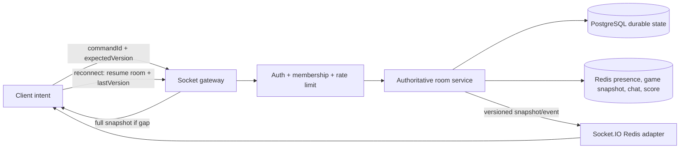

# Realtime architecture audit and remediation plan

## Implemented in this pass

- Idempotent HTTP/WS join and leave with reconciled participant counts.
- Verified Socket.IO middleware authentication; handlers never trust decoded-but-unverified JWT payloads.
- Five-second reconnect grace plus multi-tab presence check.
- Redis-backed recent chat, leaderboard, room revision and answer command deduplication.
- Versioned participant snapshots; stale REST fallback cannot overwrite newer WS state.
- Single Socket.IO reconnect owner with bounded backoff/jitter and bounded offline queue.
- Server-validated answers and server-owned score updates; client `update_score` is rejected.
- Duplicate answer `commandId` is idempotent.
- Server-authoritative game snapshot with question index, deadline, version and automatic advance.
- Host-only start/advance, reconnect snapshot recovery, persisted final leaderboard.
- One Redux/Auth provider tree, auth-only persistence, one WebSocket initializer.
- Offline chat-history fetch is caught and rendered as backend-unavailable state.
- Fixed PostgreSQL `QuestionType` schema drift by adding `SINGLE_CHOICE` migration.

## Current findings

### P0 — correctness and security

1. Room join was not idempotent: HTTP join, WS join, reconnect and React remount could each increment `current_participants`.
2. Leave/disconnect always decremented the counter, including duplicate leave and transient network loss.
3. Disconnected participants were returned by `getParticipants`, so users could remain visible after leaving.
4. Room gateway decoded JWT payload without verifying its signature. A client could spoof identity fields.
5. Gameplay is client-local. The gateway has no authoritative `start_game`, `question_started`, `answer_accepted` or `game_ended` state machine.
6. `submitAnswer` previously returned `isCorrect: false` unconditionally; client-controlled `update_score` allows score forgery.
7. Chat and scoreboard lived in process memory, so another backend replica or process restart lost state.

### P1 — availability and race conditions

1. RxJS retry and manual reconnect ran together, creating overlapping sockets and exponential request noise.
2. WebSocket initialization ran in `AuthRestorer`, `WebSocketProvider` and multiple middleware listeners.
3. REST participant fallback ran even when WS was connected; a stale REST response could overwrite a newer WS snapshot.
4. Disconnect immediately changed DB presence. Short network drops produced false leave/join flashes.
5. Room event snapshots had no revision/version, so clients could not reject stale events.
6. `useRoomQuiz` uses a global listener flag with component-local refs; the first mounted hook can own stale room state and cleanup can remove listeners needed by another component.

### P1 — performance

1. Client routes nested a second Redux/Theme/Auth provider tree, causing duplicate stores, auth restoration and requests.
2. Redux Persist blocked first render while hydrating quiz/question/category payloads. Only auth needs persistence.
3. An unused external Google font added a render-blocking request.
4. Hero image lacked a responsive `sizes` hint and downloaded a 1920px variant for a half-width desktop slot.
5. Hot realtime paths logged full participant payloads.
6. With backend `3333` offline, chat history and REST calls threw unhandled errors while WS retried indefinitely.

## Target data ownership

Rules:

- PostgreSQL owns durable room, participant and final result data.
- Redis owns ephemeral presence, current question/timer, recent chat and live leaderboard.
- The server calculates correctness and score; clients only submit answers.
- Every mutation is idempotent by `(roomId, userId, commandId)`.
- Every room event contains `roomId`, monotonic `version`, `serverTime` and event-specific payload.
- Reconnect sends `resume_room`; the server returns a current snapshot, never replays join as a new participant.

## Remediation phases

### Phase 1 — connection and presence

- Single Socket.IO reconnect owner with bounded exponential backoff and jitter.
- Verified handshake identity stored in `socket.data.userId`.
- Idempotent join/leave and authoritative participant count.
- Five-second disconnect grace; multi-tab sockets keep the user present.
- Redis-backed recent room chat and leaderboard.
- Versioned participant snapshots.

### Phase 2 — authoritative gameplay

- Add Redis `RoomGameState`: `WAITING | QUESTION | REVEAL | FINISHED`, question index, deadline and version.
- Add commands: `start_game`, `submit_answer`, `advance_question`, `end_game`, each with acknowledgement.
- Fetch correct options server-side; remove client-controlled score updates.
- Persist answer/result records and final leaderboard in PostgreSQL.
- Reconnect returns current question and remaining time calculated from server deadline.

### Phase 3 — observability and scale

- Metrics: active sockets, reconnect rate, event latency, stale command count, snapshot gap count.
- Structured logs with room/user hashes and command IDs; no tokens or full participant payloads.
- Redis adapter readiness check and graceful degradation policy.
- Load test with multiple backend replicas and forced disconnects.

## Test matrix

| Level | Scenario | Expected invariant |
|---|---|---|
| Unit | Same user joins twice | Participant count remains 1 |
| Unit | Same user leaves twice | Count remains 0, never negative |
| Unit | One of two tabs disconnects | User remains present |
| Unit | Invalid/tampered JWT | Socket rejected before any handler |
| Integration | HTTP join followed by WS join | One participant row and count 1 |
| Integration | Reconnect within grace window | No `user_left`; one refreshed snapshot |
| Integration | Reconnect after grace window | One leave then one idempotent rejoin |
| Integration | Two users join concurrently at capacity | Never exceed `max_participants` |
| Integration | Backend replica changes | Chat/game snapshot preserved through Redis |
| Game | Non-owner starts/advances | Rejected |
| Game | Duplicate answer command | One score mutation |
| Game | Forged score event | Ignored; server score unchanged |
| Game | Reconnect during question | Same question and server-derived remaining time |
| E2E | Member joins/leaves | All clients converge to identical participant list |
| E2E | Host advances question | All clients render same question/version |
| Performance | Initial public page | TTFB < 500ms, FCP < 1.8s, LCP < 2.5s in production build |
| Performance | Room event | p95 server-to-client < 250ms on local network |

## Cache strategy

- Backend Redis already caches auth, permissions, roles, categories and notifications.
- Room recent chat: Redis list, last 200, TTL 24h.
- Live leaderboard: Redis hash, TTL 6h.
- Next phase game snapshot: Redis hash/JSON, TTL room duration + 1h.
- Frontend Redux Persist: auth only. Quiz questions/progress use explicit per-attempt local storage, not the global store.
- Public HTTP data should use request deduplication/stale-while-revalidate; personal/admin data remains no-store.

## Measured baseline (development server)

- TTFB: 553ms
- FCP: 3.096s
- LCP: 5.4s
- CLS: 0.05
- LCP resource: `/banners/home.png`, downloaded as a 1920px image (~246KB decoded element area reported by browser).

Development compilation inflates these numbers, so a production gate was also run without a concurrent dev server.

## Measured after this pass (warm development server)

- TTFB: 320ms
- FCP: 464ms
- LCP: 464ms
- CLS: 0.05
- Hero image now requests a responsive 640px variant instead of 1920px.

Automated checks completed:

- Duplicate join/reconnect: `2` users remain `2`, not `3`.
- Disconnect after grace: participant count converges `2 → 1 → 0`.
- Duplicate answer command: correct answer gives `2` points once; replay is marked duplicate and score stays `2`.
- Two-question state machine: both clients receive `QUESTION 0 → QUESTION 1 → FINISHED`, versions `1 → 2 → 3`; DB room becomes `CLOSED`.
- Multi-replica: clients connected to ports 3333 and 3334 converge to 2 participants and receive cross-replica chat through Redis adapter.

## Production performance gate

- Next production build completed successfully.
- Cold local run: TTFB 675ms, FCP/LCP 1.604s, CLS 0.05.
- Warm local run: TTFB 55ms, FCP/LCP 152ms, CLS 0.05.
- First-load JS for home: 260KB; shared JS: 103KB.
